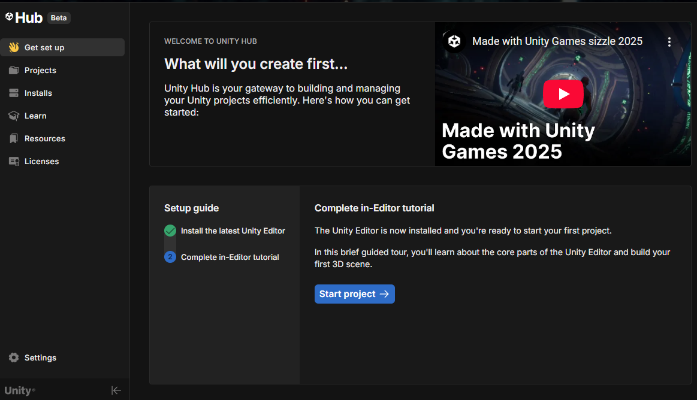
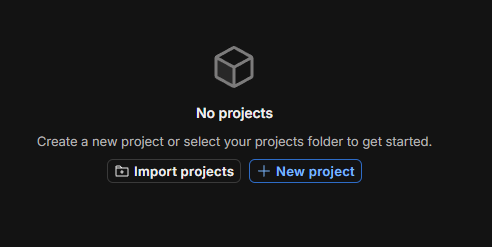
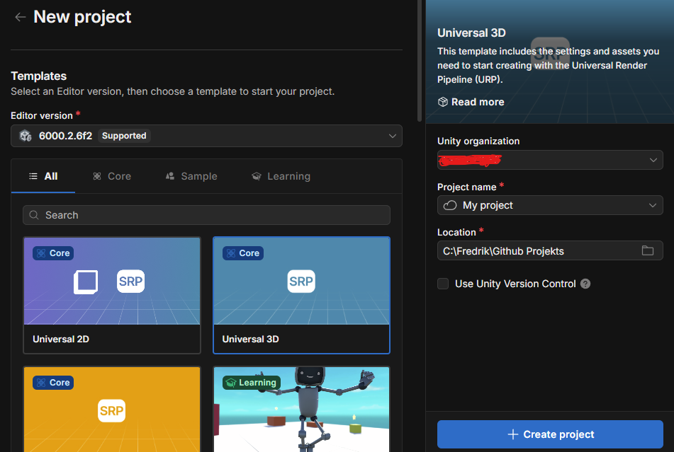
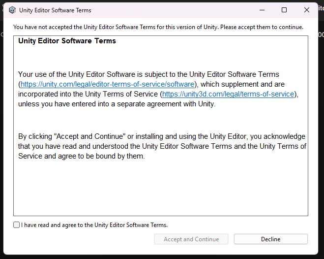

# Creating projects

`Make sure to log into the Unity Hub, and to install the latest LTS editor (current LTS is 6000.2.6f2) if you've not yet done so`

---

Inside the Unity hub you will find yourself on the `Get Started` page:

## New project

Let's navigate to the `Projects` tab and hit the `New Project` button.

This will open up the new project tab from which we can specify what type of project template to use.

For now, the `Universal 3D` will suffice.

Other options such as `Universal 2D`, `High Definition 3D` and other are available depending on what type of game you'll end up making.

Give your new project a fitting `Project Name` and select an ideal location for it.

Then hit `Create Project`.

The first time you create a new project you might be prompted to agree to the Unity software terms.

Read and comply with it and the hit `Accept and Continue` to continue creation of your project.

After this is complete, the Unity editor will open up your newly created project!