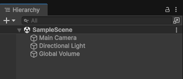
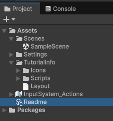

# Inside the Unity Editor

`Make sure to do "Setup And Installion" as well as "Creating Project" before continuing with this.`

---

Now that we've created our first project and the Hub has opened it for us, you'll be greeted with the default view layout of the Unity editor.

- The Top menu bar
- The Hierarchy window
- The Project and Console windows
- The Scene and Game windows 
- And the Inspector window

## Top menu

The top menu is where you'll find a lot of the essential tools.

- `Account dropdown`
  - Access your Unity account and other Unity-related settings
- `Cloud Button`
  - Opens up the Unity services window
- `Play/Pause/Step buttons`
  - Control the execution of your game in the Game View
- `AI Menu`
  - Access and manage AI-powered tools for content creation
- `Unity version control`
  - Open the window for managing your project's version control
- `Layout dropdown menu`
  - Save, load and switch between custom arrangements of your Unity Editor windows
- `Open Search`
  - A search bar to quickly find items within your project of the Unity documentation

### How it works

It has a fixed position and the toolbar is always visible at the top of the Unity Editor window and is not a dockable window.

You can customize the arrangement of the other editor windows and save those arrangements using the layout dropdown.

Unlike other windows, you cannot rearrange or drag the toolbar itself, nor its individual components.

More information [here](https://docs.unity3d.com/6000.2/Documentation/Manual/Toolbar.html).

## The Hierarchy Window

A view for all your `Game Objects` with the most recently objects created at the bottom.
Here you can re-order the `Game Objects` by dragging them up and down, or by making them `Child` or `Parent` of each other.

You may also toggle the visibility of certain objects in the scene to quickly hide or show them.
Besides the visibility controls you can also toggle between allowing blocking selection of objects in the scene while you are editing.
Very useful for large and complex scenes where it can be difficult to view and select certain objects.

There's also other things such as object creation quick access menu (the plus icon on top left) and a search bar and a popout search bar window.

By right-clicking in an empty region the hierarchy window also gives you object creation options, or various options by right-clicking a game object itself.

More information [here](https://docs.unity3d.com/6000.2/Documentation/Manual/Hierarchy.html).

## The Project Window

Here you'll find all the files related to your project, and it is the main way you can navigate and find assets and other project files.

Two Column Layout:

You may also switch between one column layout or two column layout depending on your own preferences.

One Column Layout:

Along the top edge of the Project window is a toolbar to help you out in your daily work.

- Create menu: Displays a list of assets and other sub folders you can add to the folder currently selected
- Search bar: Us the search bar to search for a file within your project. You can choose to search within the entire project, in the top level folders of your project, in the folder you've currently selected or within the asset store.
  - You can also search for X type of file with filtering options, for example: `t:scene` will display only scenes.
- Open in search: Opens the [Unity Search](https://docs.unity3d.com/6000.2/Documentation/Manual/search-overview.html) tool to refine your search.
- Search by type: Select this property to search for a specific type, e.g. `Mesh`, `Prefab` or `Scene`
- Search by label: Select this property to choose a tag to search within.
- Save search: Saves your search under `Favorites` in the left panel
- Hidden Packages count: Select this property to toggle the visibility of the packages in the Project window.

More information [here](https://docs.unity3d.com/6000.2/Documentation/Manual/ProjectView.html).

## Console Window

The console window displays errors, warning and other messages that the editor generates.
These errors and warnings will help you find issues in your project, such as script compilation errors.
You'll also find other displayed actions the editor has taken automatically, such as replacing missing meta files, which could cause an issue somewhere in your project.

To help you debug your project, you may make use of the `Debug` class to print your own messages to the console.
For example you can print a variable value at certain points in your scripts to see how they change.

You'll find more information [here](https://docs.unity3d.com/6000.2/Documentation/Manual/Console.html) about the console, and it's inner workings.

## The Scene Window

Here you visualize and interact with the world you create in the editor.
In the scene view you can select, manipulate and modify game objects that act as scenery, characters, cameras, lights and more.

Checkout this documentation to learn more about all the functionalities in the scene view [here](https://docs.unity3d.com/6000.2/Documentation/Manual/UsingTheSceneView.html).

## The Game Window

The game view is what is rendered from the cameras in your game.
It displays the final view of what your built game looks like.
You may also change and toggle between various simulator views, to display how your built game looks like on for example a mobile device.

You can read more about the game view [here](https://docs.unity3d.com/6000.2/Documentation/Manual/GameView.html).

## The Inspector Window

The inspector window displays the properties of the currently selected game object or objects if more are selected along with their related components.
It may also display any assets and their properties.

Read more about its inner workings [here](https://docs.unity3d.com/6000.2/Documentation/Manual/UsingTheInspector.html).